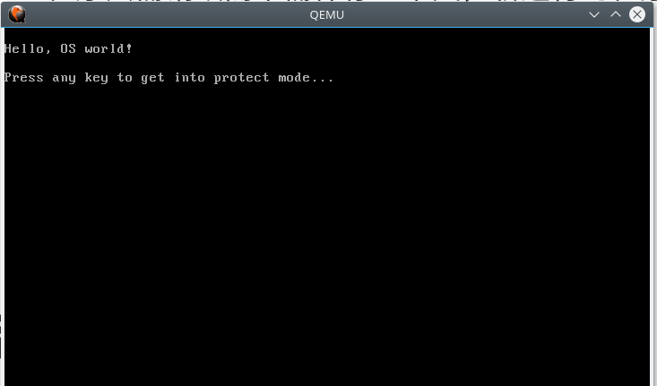
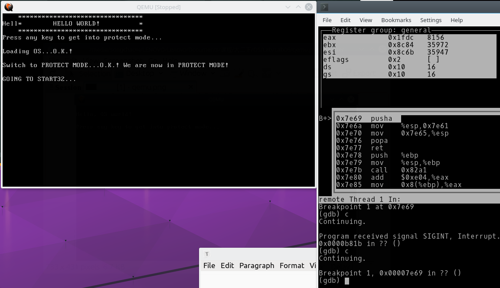
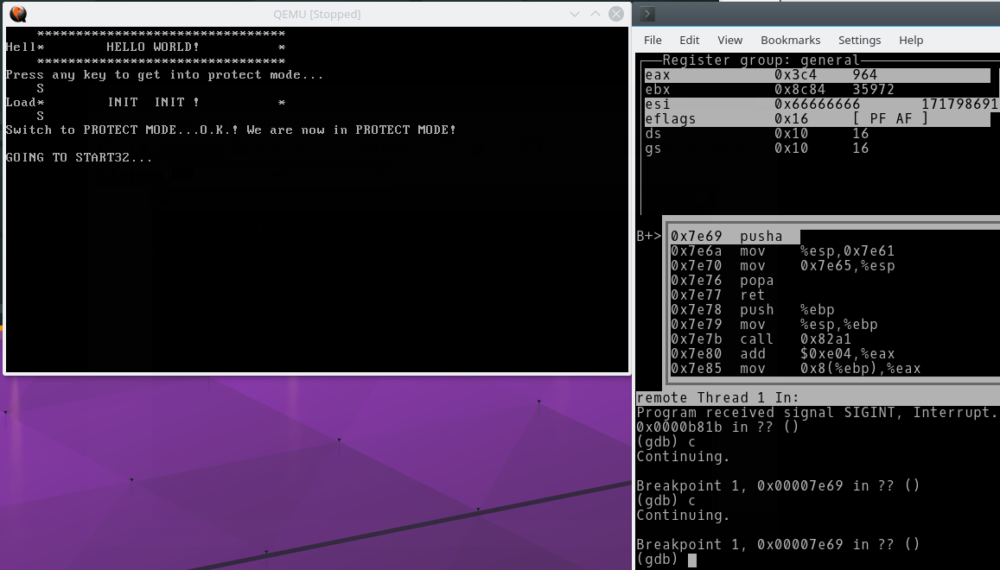
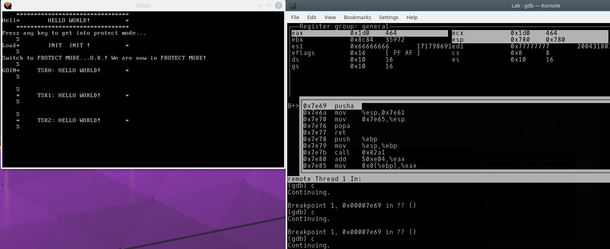

# Lab05 进程的创建、销毁 上下文切换

> PB15000102 王嵩超

## 设计概要

### 部分Tips

- initTskBody函数描述了多个任务的先后创建过程，这个预置好的过程模拟了在实际的操作系统中，要么是由用户实时发起的、要么是由某进程创建的子任务这一过程。

- initTskBody函数本身也是一个任务（init任务）。

- tskEnd由任务所在函数在末尾调用。

- 每个任务在执行一定时间（依据调度算法）后，控制权就交给scheduler。类似函数调用和返回。

- 本实验的各个task的body在运行前就已经装载到内存中。

- schedule里实现上下文切换，能用调用函数指针实现IP的切换吗?

  每个任务在结束时调用endTask，endTask又会调用schedule。schedule如果再调用任务，则可见schedule会递归循环，栈会越长越高。这显然是不符合长期使用的。

  故科学的做法是用汇编实现纯粹的跳转，不在栈上记录返回地址。

- PCB链表新节点的创建需要类似malloc的功能？

  分配的空间全部位于PCB池，故不需要内存管理算法。

  只需记录PCB池的每个位置是否被使用即可。

- 本实验中TSK_SW的应用场合
  - 从osStart函数切换至第一个任务时。调用schedule从而调用TSK_SW
  - 由第i个任务切换至第i+1个任务。

### 系统执行流程：

0x7c00:	bootloader

加载第二扇区到0x7e00

PCB(或叫TCB)池作为静态数组，此时已经被分配了空间

0x7e00:	初始化各寄存器，进行必要的输出，跳转到main函数

0x8432:	清屏，进行必要的输出，**调用**osStart函数。（此时就按gcc的calling convention进行调用而不是纯粹的跳转了）

0x8001:	osStart函数。创建initTskBody和idleTskBody。

- createTsk按顺序将新的任务加入的链表表头。为防止idleTskBody在initTskBody之后立即被执行，手动将idleTskBody置于表尾。

- createTsk还将指派各任务的栈顶地址。采用等距分布：

  ```c
  #define TSK_STACK_INTERVAL 500 //两个任务之间的间隔
  p->stack_top = stack_ptr;
  stack_ptr += TSK_STACK_INTERVAL;
  stack_ptr %= 0x10000;
  ```

首先将该任务的stack_top赋给全局变量nextTSK_StackPtr，再调用stack_init。

stack_init会在内存的nextTSK_StackPtr处写入各寄存器的初始化值，并埋下链表表头任务的IP值。

TSK_SW()首先将当前各寄存器值pusha到prevTSK_StackPtr。然后再从nextTSK_StackPtr的值装入esp寄存器。通过popa（依赖于esp）在内存中上述任务的栈顶地址处初始化各寄存器值，IP寄存器也被改变，实现了跳转。

依此方式分别执行各个任务。

0x8552:	<myTSK0>输出“TSK0	helloworld”

0x8617:	<myTSK1>输出“TSK1	helloworld”

0x86dc:	<myTSK2>输出“TSK2	helloworld”

每个任务执行完后执行tskEnd函数。tskEnd再调用schedule:

0x7f6f:	<schedule>

更新内存中prevTSK_StackPtr和nextTSK_StackPtr，分别为当前任务的栈指针和下一个任务的栈指针。这两者可以当作是传入上下文切换函数CTX_SW()的两个参数。

执行stack_init，（如果是恢复到某个任务，则不需要stack_init。但本实验中每个任务都是第一次运行。）

再调用CTX_SW()

## 实验与实际系统的联系

- init.c里的每个myTSK函数对应一个任务。该函数在末尾都加上了tskEnd函数，实现自身的销毁并返回到调度程序。tskEnd本来不应在函数的编写时由task的设计者加上，应由操作系统的loader在该程序的末尾加上一跳转语句。


- 本实验的FCFS调度算法使得每次调度时，上一个程序都已经运行完了。上下文切换显得多余（因为运行完的程序只需销毁而不需保存上下文，新运行的程序又因为是从头开始，除了IP寄存器需要初始化之外，其他上下文无需恢复）。

- 任务的创建和销毁，涉及到为等待队列分配新的PCB结点，和删除结点。然而本实验未涉及内存管理，原则上运行时是无法知晓每块内存是否被占用的，不能用malloc和free的方法实现。故我将PCB分配到一块连续的空间（但PCB仍是链表！只是其位置已经确定在这块连续的内存空间而已）。同时用tsk_state是否为0来区分某块内存是否被一个PCB占用（静态数组初始化时tsk_state默认是0），由此创建结点时便有了简易的类似malloc函数的代码。

  任务的销毁本应包括释放该任务的内存空间。但本实验未作此要求。故每个任务的代码在其结束时仍保留在内存中。

## 运行截图



输出hello world完毕，准备进行第一次上下文切换：



运行initTskBody函数，初始化几个任务。



几个任务依次运行，进入死循环结束：



