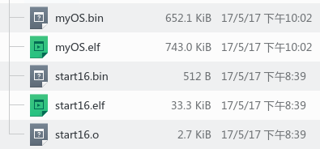
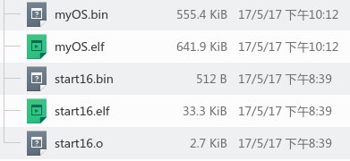
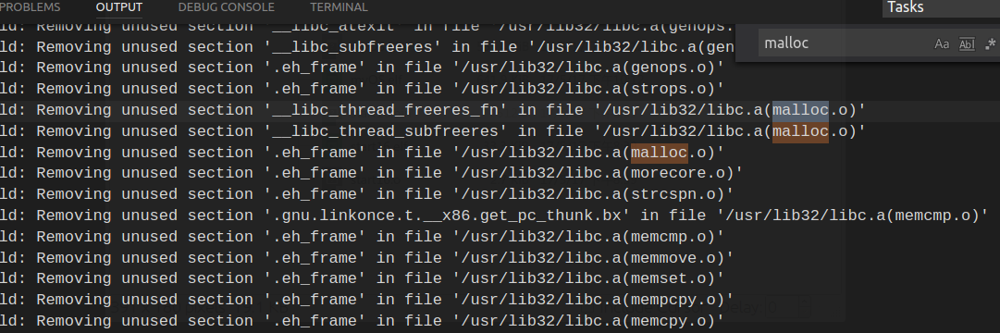
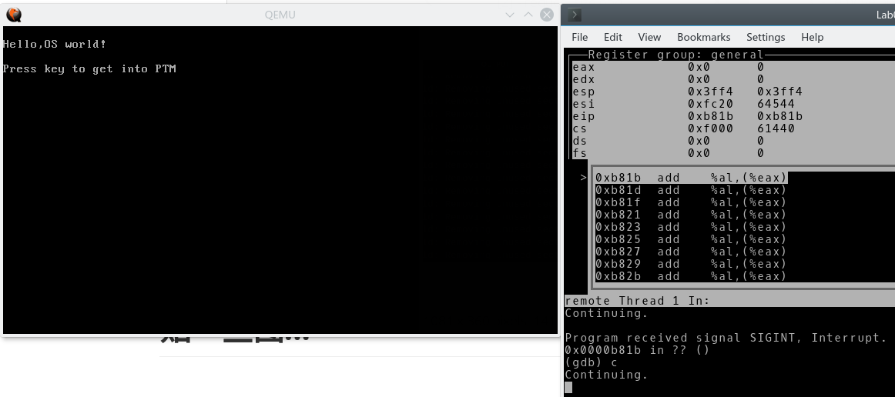
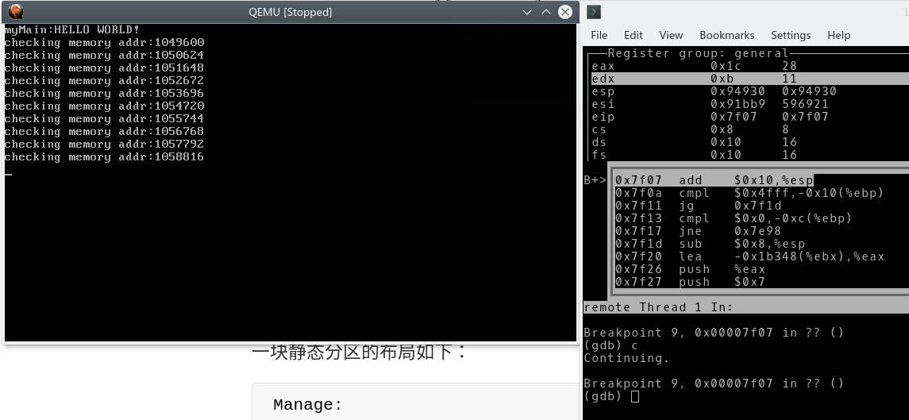
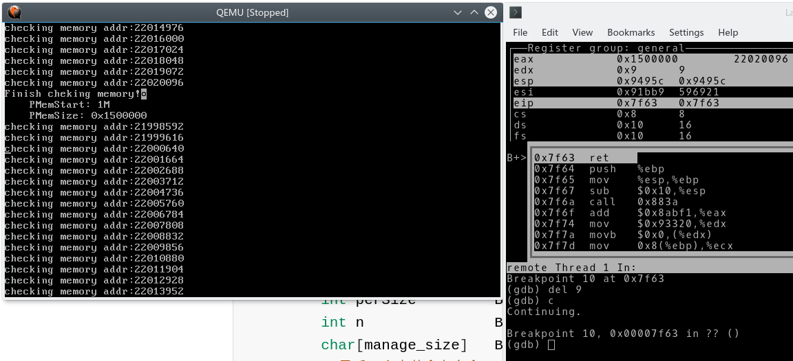
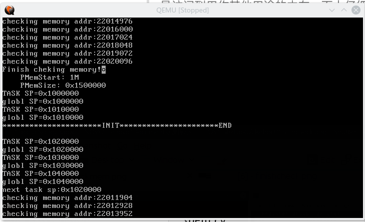
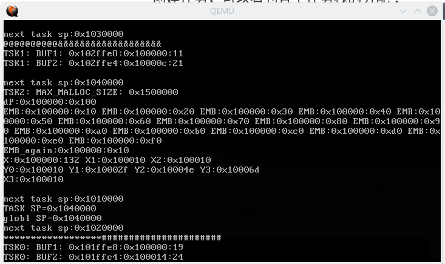

# 记一次作死的OS实验...

*Lab07 内存管理 实验报告*

> PB15000102 王嵩超

这次实验耗时三整天。其实真正的内存管理算法部分只花了几个小时就写好了，大部分的时间花在如何实现printf()，以及解决遇到的额外困难的过程。

## 为什么要链接标准库？

最初的目的很明确：为了能使用原生的全功能的vsprintf()函数（之后会解释其与printf的联系），免得自己要处理%d、%x、%s等格式化输出。

> 后来才发现老师提供的测试(userApp)所需要用的输出格式只有%x，不需要其他的判断逻辑，自己写printf并不是很麻烦。但我链接库也有别的原因：自己写printf只不过是练练手，写一下字符串的处理程序而已，并没有学啥新东西，而静态链接库以及后续所遇到的种种困难则更有挑战性。

## printf函数的实现思路

先解释一下vsprintf和printf的联系：

- vsprintf只是实现了从一个可变参数列表（如：("%dtest%s",19,"haha")是三个参数）到一个字符串的转换（上述的参数列表转换成了"19testhaha"）。vsprintf存在的意义，就是为了方便程序员开发自己的输出函数。如果只有printf作为开发的接口，则写代码时，传入的参数数量不能改变。而vsprintf传入的参数就是以参数列表(va_list)作为一个参数的，可实现任意多个参数的传入。

- 实际操作系统中：printf()先调用vsprintf得到字符串。再调用write()。write()通过系统调用将该字符串显示到输出设备上。

- write()函数在我们这个实验可以理解为写显存的那段代码，我们已经做到了。剩下要做的就是准备好vsprintf。而printf()只是一个壳工作量不大。

  对于这个实验，合适的做法是：

  vsprintf是在stdio.h里有声明的，也就是说我们系统已经有库函数了。只需要include进来stdio.h（同时还要include进stdarg.h），在我们自己的printf函数里调用vsprintf，最后静态编译即可。

## 静态链接标准库

- 静态编译在之前的实验做过。当时是直接使用gcc完成的。

- 用gcc完成编译、连接时。gcc会把库的路径、要链接的库文件等参数都传给ld，所以一般不会出错。

- 但本实验中，因为程序的入口_start是由我们自己写的(也就是位于start32.S的那个\_start标签),而gcc链接时默认的\_start是预制好了的.必须手动用ld,不能用傻瓜式的gcc来完成链接.

  > 其实用gcc来链接也说的通，入口地址也可以用参数指定。但本实验os.elf中各个段的位置都要用ld脚本指定。当gcc使用ld脚本作为输入时,试验发现：其默认的传给ld的参数(包括库的路径,要链接的库文件等)都失效了,其效果和ld一样.

  然而，如果对ld不加任何其他参数，即保持：

  ```bash
  ld  -T myOS.ld ${OS_OBJS}   -o output/myOS.elf  -static
  ```

  会出现出现未定义的对vsprintf引用，因为ld不知道标准库文件的位置。

- 需要自己加上库的路径（-L ...）和要连接的库文件（-lc等）

- 试验发现以下三个库缺一不可：libc, libgcc, libgcc_eh

- 用locate得到库文件的位置：

  - locate libc
  - locate libgcc
  - locate libgcc_eh

  可能会有多个结果。我们要选择的文件，扩展名是a（静态库），不是so（动态库）。

  用-L选项把三个库文件的路径加到ld命令后面。（每个人电脑上库的位置有可能不一样。）

- 我最终能够成功编译的命令如下：

  ```bash
  ld   -T myOS.ld ${OS_OBJS}   -o output/myOS.elf ${INCLUDE}  -static      -L /usr/lib32   -L /usr/lib -L /usr/lib/gcc/x86_64-linux-gnu/6/32/ --start-group -lc -lgcc -lgcc_eh  --end-group 
  ```
### --start group，--end group的作用

  正常情况下，一个归档文件(.a)只会按命令行顺序检索一遍。如果之前被检索到的archive1.a中包含在archive2.a中定义的符号，而archive2.a在命令中的位置在archive1.a的后面，则该符号不能被解析。--start group和--end group的作用就是反复在这几个归档文件中检索互相引用的符号，直到没有出现新的符号为止。

# 减少myOS.bin的大小——砍掉部分库函数

一步步走到最后，终于做出了myOS.bin，然而一看大小傻眼了：



其他同学的代码大小都是**几KB**的数量级。于是开始担心是否在加载过程中会遇到不连续内存。

到OSDev上查看了低内存("Low" Memory)的布局：

| start                         | end        | size                                     | type                                 | description                    |
| ----------------------------- | ---------- | ---------------------------------------- | ------------------------------------ | ------------------------------ |
| ...                           | ...        | ...                                      | unusable                             |                                |
| 0x00000500                    | 0x00007BFF | almost 30 KiB                            | RAM (guaranteed free for use)        | Conventional memory            |
| 0x00007C00 (typical location) | 0x00007DFF | 512 bytes                                | RAM - partially unusable (see above) | Your OS BootSector             |
| 0x00007E00                    | 0x0007FFFF | 480.5 KiB                                | RAM (guaranteed free for use)        | Conventional memory            |
| 0x00080000                    | 0x0009FBFF | approximately 120 KiB, depending on EBDA size | RAM (free for use, **if it exists**) | Conventional memory            |
| 0x0009FC00 (typical location) | 0x0009FFFF | 1 KiB                                    | RAM (unusable)                       | EBDA (Extended BIOS Data Area) |
| ...                           | 0x000FFFFF |                                          | unusable                             |                                |

从0x7E00到0x9FC00的大小只有600.5KB，**果然遇到了不连续内存**。

于是继续硬着头皮想解决方案。考虑到printf()函数仅使用了标准库的一小部分代码，很大一部分是无用的，于是在网上搜索ld是否有把无用的段给去掉的优化功能。查了一下还真有：

`--gc-sections`:如果该段从未被链接的其他段引用过，就将其去掉。

在命令中加入此选项，重新生成的myOS.bin只有550KB，已经能够塞进这段连续内存了。




> 其实这550KB中绝大部分库函数也是无用的。只是因为stdio.h和stdarg.h中声明了它们，ld只好将它们链接进来。其他如malloc函数都被去掉了：
>



## 修改start16.S中向RAM加载OS映像的汇编代码

计算一下可以知道550KB需要读1100左右个大小为512Byte的扇区。这极大增加了用汇编写读入扇区程序的难度，因为要写循环，还要根据CHS访问模式按规律修改柱面、磁头、扇区数、以及缓冲区的起始地址。

反复调试后的汇编代码见start16.S(刚开始，代码太长以至于start16.S的大小超过512Byte，无奈之下将之后的字符串简化压缩，才控制到了512KB之内，得以汇编）

特别注意的地方是：qemu所模拟的软盘规格为：许多个柱面、每个柱面有2个磁头数（即正反2面）、每个磁头有18个扇区。柱面数、磁头数都是从0开始，**而扇区数是从1开始!**

另外容易被坑的一点是：也许更省事的一种读入方法是每次读18个扇区，这样每次读完就不用变化扇区，直接更改磁头和柱面就行了，但这样读入约4KB的内容时会导致错误(状态码%AH=09  DMA access across 64k boundary)。INT 13H中断是使用DMA设备来完成读入的，而DMA设备是以内存中64KB为一页来进行读写的，该页不能被跨越。故每次读的内容长度应是64KB的因子。

## 调整栈顶指针%esp的位置

因为操作系统映像使用了0x7e00至0x93aa0这块空间。故栈顶的理想位置是0x100000(1MB)以后。同时栈顶地址要设的足够高(如0x101000)，避免压栈操作进行太多，访问到了非空闲区域。本实验中0x100000以后的空间均留给栈使用，这在之后的演示中可以看到。

## 应和实验报告的要求写一些

- 说明你的内存有效性检查方案，提供参考文献

  在这里啦：[http://wiki.osdev.org/Detecting_Memory_](http://wiki.osdev.org/Detecting_Memory_(x86))

  我们用的方法叫Manual Probing

  > 同时，该网页强调：本实验采用人工对内存进行反复读写的操作是极不被推荐的，因为不太仔细的算法容易访问到用作其他用途的内存，而太仔细的算法耗时太长。同时BIOS已有现成的检查内存的中断。
  >
  > 详细解释在[http://wiki.osdev.org/Detecting_Memory_(x86)#Theoretical_obstacles_to_probing](http://wiki.osdev.org/Detecting_Memory_(x86)#Theoretical_obstacles_to_probing)

- 说明你的动态分区算法和等大小固定分区算法

  - 动态分区

    采用静态结构体数组管理动态内存块：

    ```C
    //相关宏定义
    #define STATUS_FREE 0
    #define STATUS_UNUSED -1
    #define STATUS_OCCUPIED 1
    typedef struct DFreePartEntry
    {
        char status;//0:free -1:unused 1:occupied
        long addr_start;
        long addr_end;
    }DEntry;
    DEntry DEntryPool[ENTRYNUM];
    ```
    - 分区的初始化

      把数组的第一个元素status置为free，将可用的整个分区记录在第一个元素。其他元素置为unused

    - 块的分配

      遍历数组，找到一块可用的分区，若其大小足够大，则分为两块（这将使用一块之前为unused的数组元素），将合适大小的前一块分配出，标记为STATUS_OCCUPIED；将后一块标记为STATUS_FREE

    - 分区的释放

      基本是分配的逆操作，只是要注意其上、下有空闲分区时要合并，分情况判断即可，并更改标记。

  - 静态分区

    一块初始化过的静态分区的布局如下：

    ```C
    Manage:
            int perSize         Byte: 0-3
            int n               Byte: 4-7
            char[manage_size]   Byte: 8...
            //最后一个字节会有多余
    Data:
            char[n][perSize]
    ```


前两项记录此分区的性质：单元大小、单元个数。这样就不需要其他额外的数据结构。

第三项按位记录每个单元的使用情况。1为使用，0为空闲。

然后就是数据了。

算法比较固定，不会有啥太大的创意...只是位操作稍微有点繁。。有兴趣请看`memory.c`的`eFPartition`相关函数。


### 接口说明

在动态分区算法中，由于自己用的是全局数组，已经包含了全面的块信息，不需要所谓句柄来记录。故动态分区接口中我一律去掉了`DPHandler`。而固定分区算法中，用于管理内存的数据本身就位于固定分区内，故需要`EFPHandler`传递地址。

我觉得不需要把myOS.h的内容再复制到这里，实在没啥意义。

### 测试用例的设计

老师提供的init.c包含了所有的测试函数：myTSK0、myTSK1、myTSK2、initTskBody。

操作系统只负责创建initTskBody进程。initTskBody内部再创建myTSK0、myTSK1、myTSK2这三个子进程。

- myTSK0、myTSK1

  基本的malloc()和free()的测试。

- myTSK2

  先测试了最大可分配的字节数。（循环分配，当返回地址为0时停止。）

  后进行dPartition、eFPartition相关函数的测试。

  ​


## 贴一些图...

压缩文件里已包含a_boot2C.img，可用qemu运行。

进入保护模式之前的提示：



从1M内存处开始检查内存：



检查完毕：



创建任务，可以看到各个任务栈的分配：



各任务运行后的输出(TSK0先在下面输出，然后接着从第一行开始输出)：

