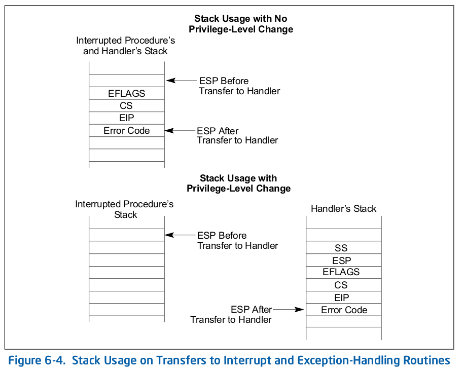
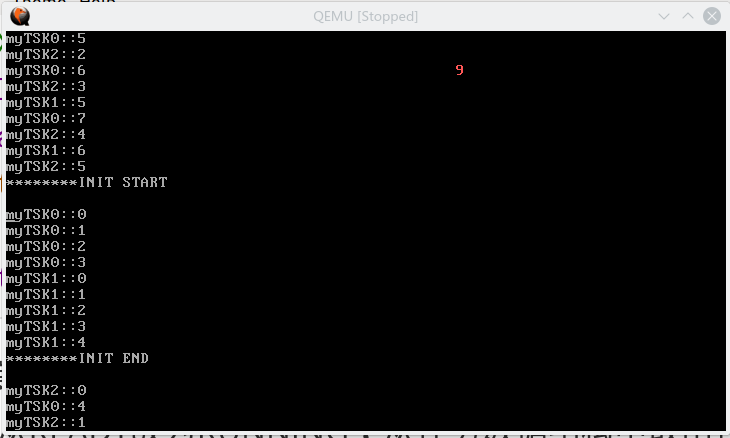

# Lab08 中断与时间片轮转调度

> PB15000102 王嵩超


## Questions and Tips

- 时钟中断对应的信号是哪个？

来自时钟硬件的中断是IRQ0，而产生的中断向量值可以由编程自定义。（一般为避免与保护模式的异常向量值冲突，可取32）

- 时钟中断的周期可否编程更改？

可以。网上有现成的操纵8259 PIC所用端口的驱动代码

http://wiki.osdev.org/8259_PIC#Code_Examples

OS Part

- 中断服务程序的内容？

执行中断服务程序时，PC, EFLAGS, 已经压栈。具体顺序参见《Intel Basic Architecture》6.4.1



~~首先应当关中断！~~中断指令自己就会把EFLAGS中的IR清掉。

应把之前的任务挂起。栈不是PC值的久留之地。应在再次对栈进行操作之前，把esp值取出，放到内存里(priv_StackPtr)，因为之后并不会按惯例从ret返回，而是利用ret对栈的读取，实现跳转。所以恢复任务时要从priv_StackPtr恢复中断前的栈。

- Lab06的那个空闲任务在有别的任务时，不作为循环的一员，否则就是一种CPU的浪费。而且空闲任务循环体内不需要调用schedule()，因为有时钟中断来执行schedule()。（md要改好多。。。。。不做Lab06那么鸡肋的顺序调度，直接做这个实验该多好）

- 我们用到的是关中断(由EFLAGS寄存器标志控制)。不是用中断屏蔽寄存器来屏蔽中断(由8259 PIC内的IMR寄存器控制)，当然本实验只用到时钟中断，为了省事，可以把其他中断都屏蔽掉。

- 比较完整的PIC(可编程中断控制器)工作流程

  - one or multiple interrupt signals(from IRQs) occur

  - PIC chooses one suitable signals, and if (not masked && not interrupt already) raise the final interrupt line

    > now any other interrupt requests cannot be satisfied

  - CPU answers

  - PIC tells CPU the interrupt vector

  - at the end of an IRQ-based interrupt routine, the code issues "end of interrupt" command, telling PIC this interrupt has been dealt with.

  - PIC is now able to serve other interrupts

  从以上可以得知：中断处理完成后，需要通过端口告知PIC此中断处理完毕。具体见http://wiki.osdev.org/8259_PIC#Code_Examples里的PIC_sendEOI函数，此函数要加在中断处理函数的末尾。

  ​

## Map from IRQ lines to interrupt vector numbers

详细解释IRQ序数与vector的联系

the number and function of each given IRQ line is fixed.

but the PIC can map the IRQ lines into different vector numbers.

In protected mode, the IRQs 0 to 7 conflict with the CPU exception which are reserved by Intel up until 0x1F. (It was an IBM design mistake.) Consequently it is difficult to tell the difference between an IRQ or an software error. It is thus recommended to change the PIC's offsets (also known as remapping the PIC) so that IRQs use non-reserved vectors. A common choice is to move them to the beginning of the available range (IRQs 0..0xF -> INT 0x20..0x2F). For that, we need to set the master PIC's offset to 0x20 and the slave's to 0x28.

## PIT Programming

we can set the max counting numbers and how the output value is going to change when the reset count is reached(this results in different modes).

OSes and BIOSes use mode 3 (see below) for PIT channel 0 to generate IRQ 0 timer ticks.

### Mode 3

Flip the output signal when the count equals the reset count and set the **count number** to zero. This mode generates a square wave.

we need to calculate the count number so that the interval of positive edges(that's when IRQ0 interrupts occur) is much approximate to 1 second.

## IDT

对其结构的描述：

http://wiki.osdev.org/IDT

本人的IDT内容：

```gas
idt_table:
	.rept 64
	.word 0x7e84#0x0000ffff&(Save_CTX-_start+0x7e00)的计算结果	#offset1
	.word 0x08					#selector
	.byte 0
	.byte 0x8E					#type attribute
	.word 0		#offset2
	.endr
```

## ISR

如Questions and Tips中所述，ISR开始时就要尽早保存esp寄存器。具体做法是先pusha，将所有通用寄存器压栈，再保存esp到prevTSK_StackPtr。

本人的ISR由两处汇编和一处C组成：

汇编A是中断入口，用于保存上下文和调用用C写的调度程序：

```gas
Save_CTX: #interrupt service routine entry
	pusha
	movl %esp, prevTSK_StackPtr
	call tick#display the seconds on the top-right corner
	call schedule #will not return!
	iret		#will not execute!
```

汇编B用于恢复上下文并跳转至另一任务（可能是新任务，也可能是另一未执行完的任务）：

```gas
Rest_CTX:
	movl nextTSK_StackPtr, %esp
	popa
	#int		$32 #manual test when debugging	
	sti		#can be deleted
	iret	#really important when we manually create the stack's data
```

C程序是调度程序，代码太长就不贴了。主要负责更改任务状态。刚执行过的任务从RUNNING改为READY，选择下一个任务从READY改为RUNNING；从任务数据结构中取出任务的esp并赋给nextTSK_StackPtr，准备好上下文切换。

## 映像制作与启动步骤

1. 解压Lab08.zip
2. 在Lab08文件夹内，make
3. "./make2.sh"
4. qemu-system-i386 -fda  a_boot2C.img

## 运行截图

右上角的红色数字为秒数。

左列INIT\_START为一开始的输出位置。输出到底后继续从第一行开始输出



> initTskBody任务用于创建任务myTSK0, myTSK1, myTSK2。本实验设计成initTskBody也能被打断。故initTskBody在创建任务的间隔中，可能会被挂起从而执行刚刚创建好了的myTSK0。myTSKi的创建过程应视为原子操作，故在前后加上了关中断指令。

